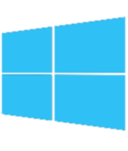
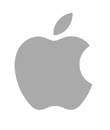
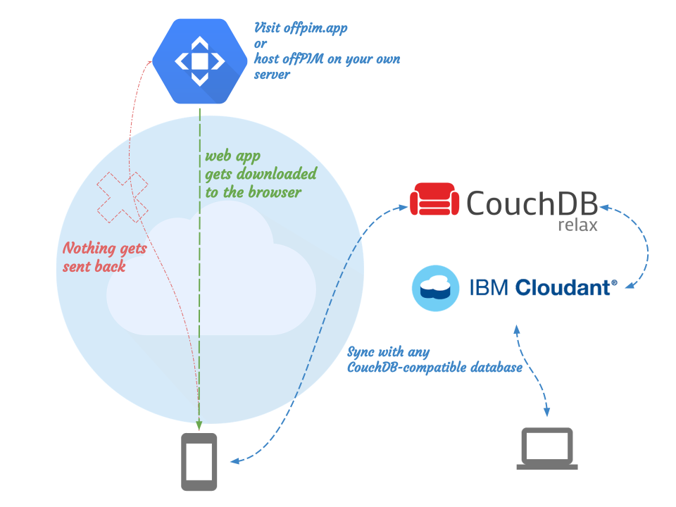
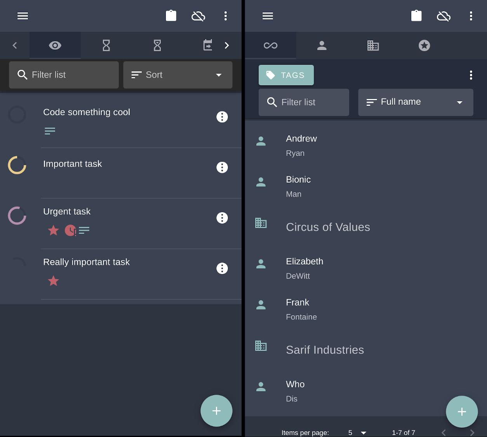

# offPIM

<p>
<strong style="background-color: var(--mdc-theme-secondary); color: whitesmoke; padding: .6rem; border-radius: 4px;">
Note:
</strong>
offPIM is not under active development. 
<br/> However, the repo will stay up, and pull requests or forks are welcome :)
</p>


---

> offPIM - A PIM - A Personal information management system
>
> Use as a Progressive Web App (PWA).
>
> Or on the desktop. Supports Windows , 
> Mac , 
> Linux , 
> and Android <a href='https://play.google.com/store/apps/details?id=tech.lybekk.offpim&pcampaignid=pcampaignidMKT-Other-global-all-co-prtnr-py-PartBadge-Mar2515-1'></a>

*Quick access*
[offpim.netlify.app](https://offpim.netlify.app)



## Screenshots

### Material design

### Dark mode & mobile ready


## Description
An easily deployable PIM made for the CouchDB ecosystem.
In an age where everything is about collaboration and sharing... This is a counterweight to that. Not everything needs to be shared. Something is just personal.

### Features
* Works offline, as in offline-first
* Local storage in browser. No server needed
* Sync back and forth to an external database (any DB supporting the CouchDB replication protocol). Full master-master replication
* Apps
    * Dashboard
        * A collection of metrics from the other apps
    * Task management
        * Projects
        * Mainly built with the GTD productivity methodology in mind. The data model also supports other task management strategies, like the the Eisenhower Matrix (Urgent-Important) with priorities 1-4 representing the four importance levels. Kanban should work too, though by using another app.
    * Notes
        * A cleaner, single-purpose interface to notes.
    * Contacts
    * Journalling/logging
    * Messaging (For general purpose information between devices and such, or whatever you feel like)
    * Search
        * Find items in offPIM by searching
* Progressive web app (PWA)
* Export/import to/from JSON
* Open source. No proprietary technologies. No external requests. No tracking.
* Self-hosted version available. BYOS(Bring Your Own Server). No backend or complicated installation procedure. Just unzip on a web server.
* Make your own
    * offPIM's data model is flat and not relational, which enables other apps to use the same data if replicated to another database, I.E. CouchDB. Create a standalone app or a piece of analytics software to analyze productivity habits, semantics, interesting discoveries about yourself, or `<insert lofty idea here>`.

**Features under development:**

* Personal Finances (Under development)
* Inventory (Under development)
* Maps (Under development)
* Themes

## <a id="gettingstarted" />Getting started
Getting offPIM up and running can be done in several ways.

*Four flavors are currently available*

* **Official app online**
    1. Visit [offpim.netlify.app](https://offpim.netlify.app).
* **Desktop-app (Electron)**
    1. [Download the app for your operating system](#downloads).
    *Windows*
    2. Double-click offpim_desktop.exe to install.
    3. Open the app from the start menu.
    *Linux*
    2. Double click the downloaded AppImage file. If that doesn't work, try the steps below.
        1. Make it executable `$ chmod a+x path-to-file/offpim_desktop.AppImage`.
        2. and run! `$ ./path-to-file/offpim_desktop.AppImage`.
    *Mac*
    2. Currently no app for Mac OS.
    **Note:** "offPIM-Electron" is currently only tested on Windows(10) and Linux(Ubuntu).
* **Android**
    1. [Download the app from Google Play Store](https://play.google.com/store/apps/details?id=tech.lybekk.offpim).
* **Self-hosted static bundle (SPA)**
    1. [Download](#downloads) and unzip contents in any directory (even root) on any HTTP-server.
    **Note:** Suitable for placing on a private VPS served by Apache, or any other http-server (I.E. python http.server or Node.js http.createServer).
* **(Alternative) Self-hosted static bundle (SPA)**
    1. [Download](#downloads) and unzip contents in any directory on your computer. As long as a browser is available, offPIM will run.

### The very easy way - Use now - Official [offpim.netlify.app](https://offpim.netlify.app)

[Use a live version of offPIM](https://offpim.netlify.app) (or use it permanently, as it works just as it will anywhere else). You may close the browser and tabs. Your data will still be stored in your browser.

| Host        | Build status    |
| ----------- |:-------------:|
| Netlify     | [](https://app.netlify.com/sites/offpim/deploys) |

* **PS:** Your data never leaves your browser, as it uses [PouchDB](https://pouchdb.com/), an in-browser database. The data entered into offPIM will never touch the server it's hosted on, as all code is downloaded to the browser and executed locally, including form submission.
* **PS2:** The downside to this however, is that the data will disappear if the browser cache/data gets deleted during an upgrade or the like. Remember to back up and/or synchronize regularly, as is crucial for all valuable data.
* **PS3:** *(For network nerds)* To verify there's no monkey business going on here, investigate the data flow yourself. Open the developer tab (F12), and check the network tab to see where the traffic goes (or rather, where it doesn't go).

### The easy way - Desktop app

1. [Download the app for your operating system](#downloads)
*Windows*
2. Double-click offpim_desktop.exe to install
3. Open the app from the start menu.
*Linux*
2. Make it executable `$ chmod a+x path-to-file/offpim_desktop.AppImage`
3. and run! `$ ./path-to-file/offpim_desktop.AppImage`
*Mac*
2. Currently no app for Mac OS

**Note:** "offPIM-Electron" is currently only built and tested on Windows(10) and Linux(Ubuntu), though it is possible to build for another OS yourself.

### The still-easy-but-requires-a-few-more-steps way (for techies)

1. [Download self-hosted offPIM](#downloads)
2. Copy contents of the zip-file into a directory (or root) to an HTTP-server of your choosing. *offPIM uses relative paths, so any directory should work*

**Note: A HTTP-server is not necessary, as offPIM has a "simple" tech stack, making it runnable can be run from a directory on the desktop**

### The hard way - Build it yourself
1. Clone the repository
2. install dependencies `npm install`
4. run `npm run build` for self-hosted, or `npm run electron:build` for desktop app

Example
```Shell
$ cd /home/user/folder
$ git clone https://github.com/lybekk/offPIM.git
$ npm install
$ npm run electron:build
```

## Self-hosted - tested setups / Deployment options

offPIM is run successfully on the following deployment setups

### CouchDB+Apache (Ubuntu)
* Apache/2.4.29 (Ubuntu)
* Couchdb 2.3 (or 3.0)

### CouchDB HTTP server
* Couchdb 2.3
Dist contents placed directly in Fauxton's directory
Serving offPIM with CouchDB's HTTP server.
use offpim/ or another sub-directory if you wish. Using offpim for simplicity here.

- Change vue.config.js publicPath to /_utils/offpim/
- put files in opt/couchdb/share/www/offpim/
- visit http://localhost:5984/_utils/offpim/

Added bonus: Turning on CORS is not necessary if put directly in CouchDB's www folder.

### Python HTTPServer
```python
import http.server
import socketserver
import webbrowser

PORT = 8000
# Binds to localhost only. Use "" for exposing this to network interfaces
HOST = "localhost" 

# Launches the server in current working directory in the default web browser
url = 'http://' + HOST + ":" + str(PORT)
webbrowser.open_new_tab(url)

# Magic
Handler = http.server.SimpleHTTPRequestHandler

with socketserver.TCPServer((HOST, PORT), Handler) as httpd:
    print("serving at port", PORT)
    httpd.serve_forever()
```

## <a id="downloads"></a>Download

<div class="card">
    <a href="https://github.com/lybekk/offpim/releases/latest/download/offpim_desktop.AppImage" class="mdc-button mdc-button--raised">
        
        Linux
    </a>
    <a href="https://github.com/lybekk/offpim/releases/latest/download/offpim_desktop.exe" class="mdc-button mdc-button--raised">
        
        Windows
    </a>
    <a href="https://github.com/lybekk/offpim/releases/latest/download/offpim_desktop.dmg" class="mdc-button mdc-button--raised">
        
        Mac OS
    </a>
    <a href="https://github.com/lybekk/offpim/releases/latest/download/offpim_self_hosted.zip" class="mdc-button mdc-button--raised">
        
        Self-hosted
    </a>
    <a href='https://play.google.com/store/apps/details?id=tech.lybekk.offpim&pcampaignid=pcampaignidMKT-Other-global-all-co-prtnr-py-PartBadge-Mar2515-1'></a>
</div>

**Note:** *The downloadable versions may be a bit behind the [offpim.netlify.app](https://offpim.netlify.app) version. A better way to build and distribute is on the drawing board*

### Requirements

#### Desktop app
* No requirements. Any computer running Windows, Linux or Mac OS will do.

#### Self-hosted
* Any HTTP Server

#### Synchronization
* A Database supporting the CouchDB replication protocol like:
    * CouchDB
    * PouchDB Server
    * Cloudant
    * Couchbase Sync Gateway

*The following setups have been tested successfully*

* CouchDB 2.x
* CouchDB 3.x
* Cloudant
* PouchDB Server
    * Tested OK on both Desktop and via [Termux on Android](https://lybekk.tech/guide/pouchdb-server-termux).

>Installation instructions for [CouchDB](https://docs.couchdb.org/en/latest/install/index.html)


#### If need for customization, or self-building:
* Node.js
* NPM

## Usage

For local customization and development, run <code>npm install</code> first.

Tests on mid-end devices with 30 000+ documents (5K in offPIM, while the rest is archived on Remote DB) performs well. 
Index optmizations are done now and then (tips welcome).


### Compiles and hot-reloads for development
```bash
npm run serve
or
electron:serve
```

### Compiles and minifies for production
```bash
npm run build
or
npm run electron:build
```

### Build for Android
1. Build web assets with `npm run capacitor:build:android`
2. Build in Android Studio- `Build/Build Bundle` or `Generate Signed Bundle`
3. Find the finished build in `offPIM/android/app/release/app-release.aab`

## Customization

See [documentation](https://lybekk.github.io/offPIM/docs/gettingstarted) for customization options.

### Security
offPIM doesn't include any built-in security features (i.e. local encryption), and relies entirely on the surrounding environment. With this in mind, it's a good idea to keep an eye open on where your data travels.
Using HTTPS, enforcing database permissions and other security best practices are recommended. 
Authentication when syncing with an external database is done through PouchDB.

## Contributing
Contributions in any form will be appreciated.

* Ideas, suggestions and feedback.
* Pull requests
* Styling tips (Code,Layout,CSS)
* Tips regarding security considerations
* Donations, of course

Commits to github will be instantly reflected on [offpim.netlify.app](https://offpim.netlify.app).
PWA Service workers may need 24 hours to update to the newest version automatically. A manual cache refresh will force download the newest version.

### Sponsoring
Using, and downloading [Brave Browser](https://brave.com/off167) from [this link](https://brave.com/off167) gets me a cup of coffee.

### Android app (Capacitor)

When building the app, add a file named `capacitor.config.json` in the root of offPIM's project folder.

Example config:
```json
{"appId":"tech.lybekk.offpim","appName":"offPIM","bundledWebRuntime":false,"webDir":"/home/username/development/offPIM/dist/bundled"}
```

## Design choices

### Name
**Formerly known as pimpim**
*(rebranded as not to be confused with a "male performance product" solving a different problem)*

### Frontend only
No backend is provided or required. For synchronization, a CouchDB/PouchDB/Cloudant database is needed.

### UI (CSS)

The choice of UI/CSS frameworks landed on Vuetify. Feature-rich and integrates exceptionally well with Vue.

### Vue Single File Components

Vue's sexy [Single File Components](https://vuejs.org/v2/guide/single-file-components.html) (SFC) provides an excellent separation of concerns and does a good job in helping reduce inevitable spaghetti code.

The drawback to SFC, some would say, is the reliance on Webpack.
The advantages one gets by utilizing Vue's entire ecosystem (Vue CLI, SFC, Router, Vuex) makes it worth it, however.

## Roadmap

### On the horizon
* Tasks app
    * View notes attached to project
* Personal finance
    * Budget
    * Expenses
    * Subscriptions
* Inventory
    * Emergency Preparedness
    * Collectibles
* Finances
* Maps
    * Logbook entries visible in map
    * Retrieval of contacts addresses
* Dashboard
    * Text-to-speech(TTS) reading of status report

### Time permitting

* Export to a format following the structure of [The big book of everything](http://www.erikdewey.com/bigbookmkIIIa.pdf)
* Android/iOS app (using couchbase lite)
* CGI/WSGI variant
    * In the future, an optional, auxilliary Python script, or CGI/WSGI backend is planned to enable server-side heavy lifting like report generation, insights (machine learning), inter-system communication and such.

## Credits
Creators and maintainers of:
* [PouchDB](https://pouchdb.com/)
* [CouchDB](https://couchdb.apache.org/)
* [Vue](https://vuejs.org/)
* [Vuetify - Vue JS component framework](https://vuetifyjs.com/en/)
* [Electron](https://www.electronjs.org/)
* [Lunr.js](https://lunrjs.com/)
* And a ton others

## License
MIT
