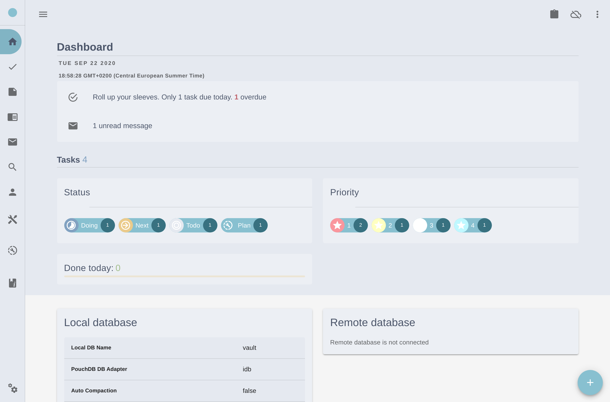
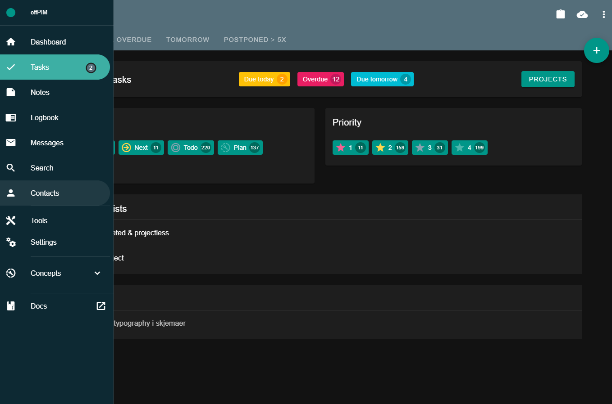

# pimpim
pimpim - A PIM - A Personal information management system




## Description
An easily deployable PIM made for the CouchDB ecosystem.
In an age where everything is about collaboration and sharing... This is a counterweight to that. Not eveything needs to be shared. Something is just personal.

Features:
* Local storage in browser. No server needed
* Sync back and forth to an external database (supporting the CouchDB replication protocol). Full master-master replication
* Export to json
* Apps
    * Task management
    * Notes
    * Journalling/logging
    * Messaging (Used for general purpose information between devices and such, or whatever you feel like)
    * Personal Finances (Under development)
    * Inventory (Under development)
* Themes
* Open source. No proprietary technologies. No external requests. No tracking.

## Try
[Try a live version of pimpim](https://lybekk.tech/pimpim/) (or use it permanently, as it works just as it will anywhere else). You may close the browser and tabs. Your data will still be there.

* PS: Your data never leaves your browser, as it uses [PouchDB](https://pouchdb.com/), an in-browser database. The data entered into pimpim will neaver touch the server it's hosted on (unless you want to synchronize with a remote database).
* PS2: The downside to this however, is that the data will disappear if the browser cache/data gets deleted during an upgrade or the like. Remember to back up and/or synchronize regularly, as is crucially regarding all valuable data.
* PS3: To verify the data flow, open the developer tab (F12), and check the network tab to see where the traffic goes (or rather where it doesn't go).

## <a id="downloads"></a>Download

<div class="card">
    <a href="https://lybekk.tech/downloads/pimpim_desktop.AppImage" class="btn">
        
        Linux
    </a>
    <a href="https://lybekk.tech/downloads/pimpim_self_hosted.zip" class="btn">
        
        Self-hosted
    </a>
</div>

## Installation

*Two flavors are currently available*

1. **Desktop-app (Electron)**
    * "PIMPIM-Electron" is currently only built and tested on Linux (though it is possible to build for another OS yourself)
    1. [Download the app for your operating system](#downloads) (currently Linux only)
    2. Make it executable `$ chmod a+x path-to-file/pimpim_desktop.AppImage`
    3. and run! `$ ./path-to-file/pimpim_desktop.AppImage`

**OR**

2. **Self-hosted static bundle (SPA)**
    * Suitable for placing on a private VPS served by Apache, or any other http-server (I.E. python http.server or Node.js http.createServer)
    1. [Download](#downloads) and unzip contents in a sub-directory named `pimpim` on any HTTP-server.

See the [documentation](docs/gettingstarted#installation) for more details and options.

### Requirements

Desktop app
* No requirements. Any computer will do.

Self-hosted
* Any HTTP Server

Synchronization
* Database supporting the CouchDB replication protocol
    * CouchDB
    * PouchDB Server
    * Cloudant
    * Couchbase Sync Gateway

If need for customization, or self-building:
* Node.JS
* NPM

## Usage

node_modules have been removed from repository. For local customization and development, run <code>npm install</code> first

Tested with 30 000+ documents and seems to work fine. Index optmizations are done continously (tips welcome).

### Compiles and hot-reloads for development
```
npm run serve
or
electron:serve
```

### Compiles and minifies for production
```
npm run build
or
npm run electron:build
```

## Customization

See [documentation](docs/gettingstarted) for customization options.

### Security
PIMPIM doesn't include any built-in security features (i.e. local encryption), and relies entirely on the surrounding environment. With this in mind, it's a good idea to keep an eye open on where your data travels.
Using HTTPS, enforcing database permissions and other security best practices are recommended. 
Authentication when syncing with an external database is done through PouchDB.

## Contributing
Contributions in any form will be appreciated.

* Ideas, suggestions and feedback.
* Styling tips (Code,Layout,CSS)
* Tips regarding security considerations
* Donations, of course

### Sponsoring
Using, and downloading [Brave Browser](https://brave.com/lyb569) from [this link](https://brave.com/lyb569) gets me a cup of coffee as well.

## Roadmap

[Take a look](docs/roadmap)

## Credits
Creators and maintainers of:
* [PouchDB](https://pouchdb.com/)
* [CouchDB](https://couchdb.apache.org/)
* [Vue](https://vuejs.org/)
* [Vuetify - Vue JS component framework](https://vuetifyjs.com/en/)
* [Nano - NPM library for CouchDB](https://www.npmjs.com/package/nano)
* [Electron](https://www.electronjs.org/)

## License
MIT
